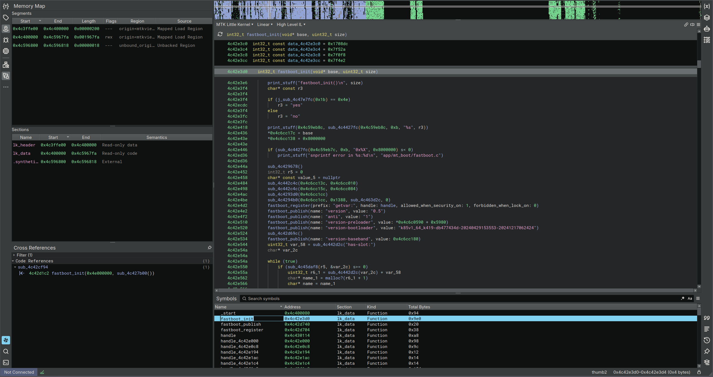

# mtkview

Loads GFH preloader binaries and MTK Little Kernel partitions. Still WIP but working atm!

- dev branch = Binja dev
- binja_stable_x.x branch = Binja stable with version

Please report issues!

### Load MTK binaries:
- Preloaders
- LK

## Build and install yourself

`git clone https://github.com/osecurio/mtkview`

`cd mtkview`

`DEP_BINARYNINJACORE_PATH=<PATH_TO_BINJA_DIR> cargo build --release`

`cp target/release/*.so ~/.binaryninja/plugins/`

## How to use

After building and installing, open Binary Ninja and select a partition or a raw MTK Preloader/LK binary. The binja view should say `MTK <Binary Type>`.

## Screenshot

## Kudos
- Thanks to [@R0rt1z2](https://github.com/R0rt1z2/) for letting me pick your brain about MTK stuff.
